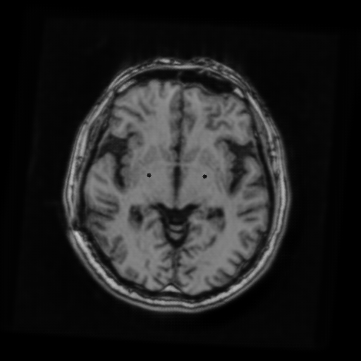

# DBS-GAN

The code is based on [Jun-Yan Zhu](https://github.com/junyanz)'s [pytorch-CycleGAN-and-pix2pix](https://github.com/junyanz/pytorch-CycleGAN-and-pix2pix).

DBS-GAN is a CycleGAN based model that transforms post-DBS images to normal images. It removes both artifacts and electrodes from post-DBS images. With the knowledge of electrodes position, we may add electrodes back to the reconstructed images to obtain an artifacts-free counterpart of the post-DBS image.

  

### Training
To train the model, you just need to run the corresponding script in the `scripts` folder
```bash
sh scripts/train_antgandualpatch.sh
```

To visualize the training results (eg. loss, training output), you can run `tensorboard.sh` 
```bash
sh tensorboard.sh
```

If `tensorboard.sh` is run on a server, you can run `local.sh` on your local machine to access the visualization
```bash
sh local.sh
```

### Testing
To test the model, you just need to run the corresponding script in the `scripts` folder
```bash
sh scripts/test_antgandualpatch.sh
```

### Results Processing
To add electrodes back to the reconstructed image, you can run `post_processing.py`
```bash
python post_processing.py
```

To transform the 2D output images into 3D nii voxels, you can run `visualization.py`
```bash
python visualization.py
```